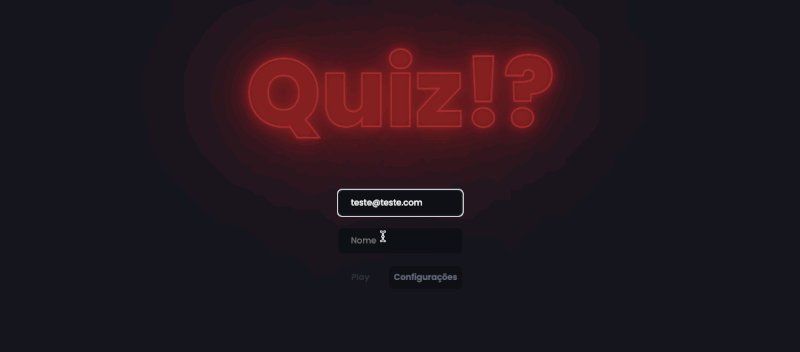

<h1 align="center">Trivia React</h1>

<p align="center">
  Projeto desenvolvido durante o módulo de front-end no curso da trybe
</p>

## 📋 Sobre
O projeto consiste em desenvolver um jogo de Quiz que possui um sistema de ranking, utilizando React e Redux para gerenciar os contextos, e utilizando RTL(react testing library) para realizar testes unitários



## 💻 Tecnologias


## 🧠 Aprendizados
- Utilizar Redux para gerenciar contextos
- Praticar testes unitários no front-end com RTL

## 📦 Rodando o projeto

Instale as dependências
```bash
npm i
```
Rode a aplicação
```bash
npm start
```
